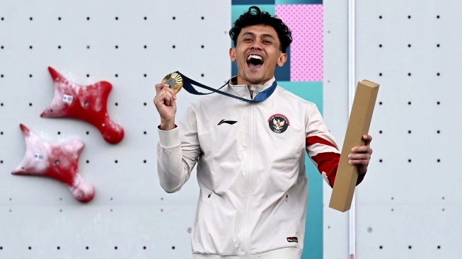

```{r, echo=FALSE}
knitr::opts_chunk$set(
  echo = FALSE,
  results = 'show', 
  message = FALSE,  
  warning = FALSE   
)

```


{width=800, height=400}


Have you ever wondered why Olympic gymnasts tend to be in their early 20s, while athletes in other Olympic sports, like shooting, are often much older on average?

The answer lies in the unique demands of each sport—whether it's flexibility, endurance, mental sharpness, or other attributes. By analyzing modern Olympic data from the 1948 edition, which marked the rise of athletics sprinting as arguably the most iconic event, to the 2016 Rio edition, combined with ESPN's toughest sports rankings, we can uncover how different key attributes shape an athlete's career longevity. These findings provide valuable insights for developing training strategies that can help aspiring Olympians reach their full potential.


## Problem Description

The Olympic Games showcase athletes performing at their best, both physically and mentally, across a wide range of sports. In this post, we’ll look at the trends in peak and average ages of Olympians, focusing on how key traits like flexibility, endurance, mental toughness, and strategy impact these patterns. Understanding these trends can help coaches fine-tune their training plans and extend athletes’ careers. By grouping sports based on their main physical and mental demands, we can uncover new insights into how different challenges shape an athlete's journey.

The age at which athletes hit their peak varies significantly depending on the sport and its demands. Knowing this can be valuable for aspiring Olympians and their trainers, helping them decide when to start specialized training and when to aim for competition. This insight also helps coaches create better training routines so athletes can hit their prime at just the right time. It also aids coaches and trainers in designing more effective regimens, ensuring athletes reach their full potential at the optimal time.


## Data Description

The analysis combines two datasets:

- [ESPN Toughest Sports:](https://www.espn.com/espn/page2/sportSkills) This dataset ranks 60 sports across 10 skill categories: **endurance (END)**, **strength (STR)**, **power (PWR)**, **speed (SPD)**, **agility (AGI)**, **flexibility (FLX)**, **nerve (NER)**, **durability (DUR)**, **hand-eye coordination (HAN)**, **analytic aptitude (ANA)**. Each category reflects the unique demands placed on athletes in their respective sports, allowing for a comprehensive understanding of how these attributes correlate with age.

- [Olympic Data:](https://www.kaggle.com/datasets/bhanupratapbiswas/olympic-data) This dataset is collected from Kaggle, from user Bhanupratap Biswas, includes information on every athlete who competed in the Olympics from the 1896 edition to the 2016 edition summer and winter, including their profile, event participation, olympic commitee represented. This time, however, we focus on data from 1948-2016 to align with the era of the _modern olympics games._

- **Data Processing Steps:** Firstly, we read raw dataset file; followed by clean symbols and unused variables, name manipulation (especially handle the difference of country name); join the two data (the output will contain variable of attributes' scoring system); lastly plot the data divided by their main physical or mental demand.


## Analysis

```{r, Loading Dataset and view the data, results='hide'}
library(tidyverse)
library(visdat)
library(summarytools)

oly_data <- read_csv("data/dataset_olympics.csv") |>
  select(-Medal, -Games, -ID, -Season) |>
  filter(Year >= 1948) |> 
  drop_na()

glimpse(oly_data)

#dfSummary(oly_data) # nanti hapus

```


```{r Modify oly data, results='hide'}
library(dplyr)

oly_data1 <- oly_data |>
  # Rename specific sports
  mutate(Sport = case_when(
    Sport == "Luge" ~ "Bobsleigh",
    Sport == "Skeleton" ~ "Bobsleigh",
    Sport == "Taekwondo" ~ "Martial Arts",
    Sport == "Judo" ~ "Martial Arts",
    Sport == "Softball" ~ "Baseball",
    Sport == "Short Track Speed Skating" ~ "Speed Skating",
    TRUE ~ Sport)) |>
  # Use regex to rename based on "Event" column
  mutate(Sport = case_when(
    grepl("Pole Vault", Event) & Sport == "Athletics" ~ "Athletics_PoleVault",
    grepl("High Jump", Event) & Sport == "Athletics" ~ "Athletics_HighJumps",
    grepl("Throw|Shot Put", Event) & Sport == "Athletics" ~ "Athletics_Weights",
    grepl("100|110|200|400", Event) & Sport == "Athletics" ~ "Athletics_Sprints",
    grepl("800|1,500|3,000", Event) & Sport == "Athletics" ~ "Athletics_MidDistance",
    grepl("5,000|10,000", Event) & Sport == "Athletics" ~ "Athletics_LongDistance",
    grepl("Sprint", Event) & Sport == "Cycling" ~ "Cycling_Sprints",
    grepl("50 metres|100 metres", Event) & Sport == "Swimming" ~ "Swimming_Sprints",
    TRUE ~ Sport)) |>
  mutate(Sport = case_when(
    Sport == "Swimming" ~ "Swimming_Distance",
    Sport == "Cycling" ~ "Cycling_Distance",
    TRUE ~ Sport)) |>
  mutate(Sport = case_when(
    grepl("Jump", Event) & Sport == "Athletics" ~ "Athletics_Jumps",
    TRUE ~ Sport)) |>
  mutate(Sport = case_when(
    Sport == "Athletics" ~ "Athletics_LongDistance", TRUE ~ Sport))

# View updated data
head(oly_data1, 5)

#write.csv(oly_data1, "data/oly_data1.csv")

```


```{r looking at the data, results='hide'}
library(readxl)
library(dplyr)

oly_byyear <- oly_data1 |> 
  group_by(Year) |>
  distinct(Sport)

# Read the data and rename the SPORT column
attr_data <- read_xlsx("data/toughestsport_attributes.xlsx") |>
  mutate(SPORT = case_when(
    SPORT == "Skiing: Alpine" ~ "Alpine Skiing",
    SPORT == "Skiing: Freestyle" ~ "Freestyle Skiing",
    SPORT == "Racquetball/Squash" ~ "Racquets",
    SPORT == "Track and Field: Pole Vault" ~ "Athletics_PoleVault",
    SPORT == "Track and Field: High Jump" ~ "Athletics_HighJumps",
    SPORT == "Track and Field: Long, Triple jumps" ~ "Athletics_Jumps",
    SPORT == "Track and Field: Distance" ~ "Athletics_LongDistance",
    SPORT == "Track and Field: Middle Distance" ~ "Athletics_MidDistance",
    SPORT == "Track and Field: Sprints" ~ "Athletics_Sprints",
    SPORT == "Track and Field: Weights" ~ "Athletics_Weights",
    SPORT == "Football" ~ "footballz",
    SPORT == "Soccer" ~ "Football",
    SPORT == "Field Hockey" ~ "Hockey",
    SPORT == "Team Handball" ~ "Handball",
    SPORT == "Canoe/Kayak" ~ "Canoeing",
    SPORT == "Weight-Lifting" ~ "Weightlifting",
    SPORT == "Bobsledding/Luge" ~ "Bobsleigh",
    SPORT == "Equestrian" ~ "Equestrianism",
    SPORT == "Cycling: Distance" ~ "Cycling_Distance",
    SPORT == "Cycling: Sprints" ~ "Cycling_Sprints",
    SPORT == "Baseball/Softball" ~ "Baseball",
    SPORT == "Bobsledding/Lugo" ~ "Bobsleigh",
    SPORT == "Swimming (all strokes): Distance" ~ "Swimming_Distance",
    SPORT == "Swimming (all strokes): Sprints" ~ "Swimming_Sprints",
    SPORT == "Cycling: Sprints" ~ "Cycling_Sprints",
    SPORT == "Skiing: Nordic" ~ "Nordic Combined",
    TRUE ~ SPORT)) |>
  rename(`Sport` = `SPORT`) |>
  filter(Sport != "footballz")

# Display the renamed data
head(attr_data, 5)

#write.csv(attr_data, "data/attrdata.csv")
```

```{r Creating Top 3 Attributes per Sport Category}
# Pivot longer
attr_long <- attr_data |>
  select(-TOTAL, -RANK) |>
  pivot_longer(cols = -Sport, names_to = "attr", values_to = "values")


# Rank and select top 3 attributes for each sport
top_attrs <- attr_long %>%
  group_by(Sport) %>%
  arrange(desc(values)) %>%
  slice_head(n = 3) %>%
  mutate(rank = row_number()) %>%
  select(Sport, attr, values, rank)


# Pivot wider to get top 3 attributes in separate columns
attr_top_wide <- top_attrs %>%
  pivot_wider(names_from = rank, values_from = c(attr, values), names_sep = "_") %>%
  rename(
    Top_1_attr = attr_1, Top_1_value = values_1,
    Top_2_attr = attr_2, Top_2_value = values_2,
    Top_3_attr = attr_3, Top_3_value = values_3)

```


```{r, results='hide'}
oly_attr_join <- left_join(oly_data1, attr_top_wide, by = "Sport") |> drop_na()

#write.csv(oly_attr_join, "data/oly_final.csv")

glimpse(oly_attr_join)
```

To break down the data, we’ll use two key visuals. First, we'll look at a plot showing the overall average age for each sport’s main attribute. Then, we’ll dive deeper with boxplots that show how the ages are distributed within each sport category, grouped by attribute. This will help us spot trends and explore some sports with particularly interesting patterns.


```{r}
#| label: tbl-avgage
#| tbl-cap: Average Age of Athletes per Sports' Primary Attribute.

library(kableExtra)

# Create a named vector for attribute names
attribute_names <- c("END" = "Endurance", 
                     "STR" = "Strength", 
                     "PWR" = "Power", 
                     "SPD" = "Speed", 
                     "AGI" = "Agility", 
                     "FLX" = "Flexibility", 
                     "NER" = "Nerve", 
                     "DUR" = "Durability", 
                     "HAN" = "Hand-eye Coordination", 
                     "ANA" = "Analytic Aptitude")

# Update the pipeline to include attribute name mapping
n <- oly_attr_join |>
  select(Age, Sport, Top_1_attr) |>
  group_by(Top_1_attr) |>
  summarise(Average_Age_years = round(mean(Age), 0)) |>  
  mutate(Primary_Attribute = Top_1_attr, 
         Attribute_Full = 
           attribute_names[Top_1_attr]) |>               
  select(-Top_1_attr) |>                               
  relocate(Average_Age_years, .after = last_col()) |>   
  arrange(desc(Average_Age_years))

n |>
  kable(caption = " ", 
        align = 'c') |>  # Center align the columns
  kable_styling(bootstrap_options = c("striped", "hover", "condensed", "responsive"), 
                full_width = FALSE, 
                position = "center",
                font_size = 10) |>  
  row_spec(0, bold = TRUE, color = "white", background = "#4CAF50") |>  
  column_spec(1, bold = TRUE) 

```


@tbl-avgage shows the average age of athletes per sports’ primary attribute. Sports requiring _Flexibilty_ tend to have participant of the averaging at the early 20s, while those requiring _Analytical Aptitude,_ reached 32 years old.

These findings align with previous research on athletic performance and aging. For instance, a study by [Berthelot et al. (2012)](https:doi.org//10.1007/s11357-011-9274-9) found that the age of peak performance varies significantly across different sporting events, supporting our observations.

After we know the general idea of the distribution between category, let's dive deeper to get more insight by using boxplot to depict each sport events. Boxplot is choosen to be used, due to its ability to contain information such as _Median_, _Average_, _Inter Quartile Range_, and _Outliers_. These features allows us to see the **Peak Age** and **Career longevity** of each sports.


```{r Top 1 Attributes, warning=FALSE}
#| label: fig-boxplottop1attr
#| fig-cap: Age Distribution by Top Attributes (Endurance, Power, Speed, Agility).

library(ggplot2)
library(patchwork)
library(cowplot)

# Create the boxplot for Top_1_attr = END
p1 <- ggplot(oly_attr_join %>% filter(Top_1_attr == "END"), aes(x = Sport, y = Age)) +
  geom_boxplot() +
  scale_y_continuous(breaks = seq(20, 60, by = 2)) +
  labs(title = "END",
       x = "Sport",
       y = "Age") +
  theme_minimal() +
  theme(axis.text.x = element_text(angle = 45, hjust = 1))

# Create the boxplot for Top_1_attr = STR
p2 <- ggplot(oly_attr_join %>% filter(Top_1_attr == "STR"), aes(x = Sport, y = Age)) +
  geom_boxplot() +
  scale_y_continuous(breaks = seq(20, 60, by = 2)) +
  labs(title = "STR",
       x = "Sport",
       y = "Age") +
  theme_minimal() +
  theme(axis.text.x = element_text(angle = 45, hjust = 1))

# Create the boxplot for Top_1_attr = PWR
p3 <- ggplot(oly_attr_join %>% filter(Top_1_attr == "PWR"), aes(x = Sport, y = Age)) +
  geom_boxplot() +
  scale_y_continuous(breaks = seq(20, 60, by = 2)) +
  labs(title = "PWR",
       x = "Sport",
       y = "Age") +
  theme_minimal() +
  theme(axis.text.x = element_text(angle = 45, hjust = 1))

# Create the boxplot for Top_1_attr = SPD
p4 <- ggplot(oly_attr_join %>% filter(Top_1_attr == "SPD"), aes(x = Sport, y = Age)) +
  geom_boxplot() +
  scale_y_continuous(breaks = seq(20, 60, by = 2)) +
  labs(title = "SPD",
       x = "Sport",
       y = "Age") +
  theme_minimal() +
  theme(axis.text.x = element_text(angle = 45, hjust = 1))

# Create the boxplot for Top_1_attr = AGI
p5 <- ggplot(oly_attr_join %>% filter(Top_1_attr == "AGI"), aes(x = Sport, y = Age)) +
  geom_boxplot() +
  scale_y_continuous(breaks = seq(20, 60, by = 2)) +
  labs(title = "AGI",
       x = "Sport",
       y = "Age") +
  theme_minimal() +
  theme(axis.text.x = element_text(angle = 45, hjust = 1))

# Create the boxplot for Top_1_attr = FLX
p6 <- ggplot(oly_attr_join %>% filter(Top_1_attr == "FLX"), aes(x = Sport, y = Age)) +
  geom_boxplot() +
  scale_y_continuous(breaks = seq(20, 60, by = 2)) +
  labs(title = "FLX",
       x = "Sport",
       y = "Age") +
  theme_minimal() +
  theme(axis.text.x = element_text(angle = 45, hjust = 1))

# Create the boxplot for Top_1_attr = NER
p7 <- ggplot(oly_attr_join %>% filter(Top_1_attr == "NER"), aes(x = Sport, y = Age)) +
  geom_boxplot() +
  scale_y_continuous(breaks = seq(20, 60, by = 2)) +
  labs(title = "NER",
       x = "Sport",
       y = "Age") +
  theme_minimal() +
  theme(axis.text.x = element_text(angle = 45, hjust = 1))

# Create the boxplot for Top_1_attr = DUR
p8 <- ggplot(oly_attr_join %>% filter(Top_1_attr == "DUR"), aes(x = Sport, y = Age)) +
  geom_boxplot() +
  scale_y_continuous(breaks = seq(20, 60, by = 2)) +
  labs(title = "DUR",
       x = "Sport",
       y = "Age") +
  theme_minimal() +
  theme(axis.text.x = element_text(angle = 45, hjust = 1))

# Create the boxplot for Top_1_attr = HAN
p9 <- ggplot(oly_attr_join %>% filter(Top_1_attr == "HAN"), aes(x = Sport, y = Age)) +
  geom_boxplot() +
  scale_y_continuous(breaks = seq(20, 60, by = 2)) +
  labs(title = "HAN",
       x = "Sport",
       y = "Age") +
  theme_minimal() +
  theme(axis.text.x = element_text(angle = 45, hjust = 1))

# Create the boxplot for Top_1_attr = ANA
p10 <- ggplot(oly_attr_join %>% filter(Top_1_attr == "ANA"), aes(x = Sport, y = Age)) +
  geom_boxplot() +
  scale_y_continuous(breaks = seq(20, 60, by = 2)) +
  labs(title = "ANA",
       x = "Sport",
       y = "Age") +
  theme_minimal() +
  theme(axis.text.x = element_text(angle = 45, hjust = 1))

# Combine the plots in a 5x2 grid
combined_plot1 <- (p1 | p3 | p4 | p5) +
                 plot_layout(widths = c(8, 8, 5, 3)) +
                 plot_annotation(title = "Age Distribution by Top Attributes",
                   theme = theme(
                     plot.title = element_text(
                       hjust = 0.5, face = "bold", size = 13)
                   )
                 )

combined_plot2 <- (p6 | p7 | p9 | p10) +
  plot_layout(widths = c(4, 5, 7, 2))  


combined_plot3 <- (p2 | p8) +
  plot_layout(widths = c(2, 2))


# Display the combined plot
print(combined_plot1)

```


```{r}
#| label: fig-boxplottop1attr2
#| fig-cap: Age Distribution by Top Attributes (Flexibility, Nerve, Handling, Analytics).

print(combined_plot2)
```

```{r}
#| label: fig-boxplottop1attr3
#| fig-cap: Age Distribution by Top Attributes (Strength and Durability).

print(combined_plot3)

```

The analysis further reveals that sports relying on endurance and nerve also see higher average ages, indicating longer careers for athletes in these disciplines.

Athletics, even though categorised as one by the olympic body (IOC), in reality has different primary attribute demands according to the events. For example, _Athletics_LongDistance_ in @fig-boxplottop1attr that includes sport disciplines of more than 3.000 m distance requires **endurance** the most, in contrast to majority of other athletics category require **power** the most.

Looking at each primary attribute categories, interestingly, _Shooting_ and _Equestrianism_ on @fig-boxplottop1attr2 has the age distribution much older than its friend in the same category, reaching 30s. This means that to become an athlete of the

Sports that primarily rely on Mental Attributes than Physical Attributes (such as analytics skill and nerve), tend to have a longer career span, reaching more than 10 years. This number is way above average of 4-5 years in other categories (seen on three figures), excluding sports with main attribute of _Handling._ However, the ESPN thoughest sports dataset also uncover that there are several sports considered the hardest, these sports rely on more than one primary attributes, as shown at table below.

```{r}
#| label: tbl-top5
#| tbl-cap: The Thoughest Sports according to ESPN Scoring.

library(readxl)
library(kableExtra)

toughest <- read_xlsx("data/toughestsport_attributes.xlsx")
toughest5 <- toughest |> head(5)

toughest5 |>
  kable(caption = " ", 
        align = 'c') |>  
  kable_styling(bootstrap_options = c("striped", "hover", "condensed", "responsive"), 
                full_width = FALSE, 
                position = "center",
                font_size = 10)
```


We can see that for **Boxing** the attribute demands are spread evenly, meaning to be a top boxing athlete, the person should possess almost all physical excellence, except only flexibility and also prowess in handling pressure (nerve) and power (durability). **Ice hockey** demands every aspect, except flexibility. This is make sense because the game require teamwork, understand strategy, adapt to the opponent's move, speed, and stamina. 


## Conclusion

Our analysis uncovers clear age patterns among Olympic athletes, showing that younger athletes tend to excel in flexibility-driven sports, while older athletes thrive in sports that require mental sharpness and nerves of steel. By examining data from the 1948 to 2016 Olympics alongside ESPN's Toughest Sports rankings, we get a deeper understanding of how different physical and mental demands shape an athlete’s career path.

The data highlights how key attributes—like flexibility, mental toughness, and strategy—impact when athletes peak. For example, sports that prioritize flexibility tend to favor younger competitors, while those that require experience and quick decision-making see older athletes performing at their best.

These insights are invaluable for coaches, trainers, and athletes themselves. By aligning training programs with an athlete’s natural development and the specific demands of their sport, they can maximise performance and extend careers. Recognising these patterns can also help athletes and their support teams make more informed decisions about when to focus on certain aspects of training and which sports may offer greater career longevity.

In the end, understanding how age and athletic attributes intersect can help future Olympians reach their full potential, while also shaping smarter training strategies and career planning for all involved.

\newpage

## References

Berthelot, et al. (2012). Exponential growth combined with exponential decline explains lifetime performance evolution in individual and human species. Age, 34, 1001-1009. [https://doi.org/10.1007/s11357-011-9274-9](https://doi.org/10.1007/s11357-011-9274-9)

De Bosscher, V., Descheemaeker, K., & Shibli, S. (2023). Starting and specialisation ages of elite athletes across Olympic sports: An international cross-sectional study. European Journal of Sport Sciences. [https://doi.org/10.24018/ejsport.2023.2.5.100](https://doi.org/10.24018/ejsport.2023.2.5.100)

ESPN. (2021). Degree of difficulty: Ranking the toughest sports. ESPN. Retrieved from [https://www.espn.com/espn/page2/sportSkills](https://www.espn.com/espn/page2/sportSkills)

Longo, A. F., Siffredi, C. R., Cardey, M. L., Aquilino, G. D., & Lentini, N. A. (2020). Age of peak performance in Olympic sports: A comparative research among disciplines. Journal of Sports Sciences, 11(1), 141-152. [https://doi.org/10.14198/jhse.2016.111.03](https://doi.org/10.14198/jhse.2016.111.03)

